# Frame Blur Detection

The goal is a **universal, blur-specific detector for video frames**: a model that separates sharp frames from frames
degraded by blur, motion blur in particular, independently of the film, the shot or the recording. The reported
100-epoch runs use a fixed, narrow, people-centred snapshot (37 processed video files, representing 36 unique video groups: one file
duplicates another under a different name) and its validation split; universality is the aim, not yet a demonstrated
property. It is the first stage of a longer pipeline
(selecting sharp frames → recognising the type of blur → restoring blurred frames).


*In this visual summary, "37 labelled videos" counts files (36 unique video groups). The reconstruction statement
refers to the ideal, unnormalised residual; the rounded, masked and normalised model input requires the qualifications
in METHOD §7. The normalisation reduces scale dependence and includes a floor.*

The full description of the material, the labelling, the training and the evaluation is in [METHOD.md](METHOD.md).
This page summarises the approach and the results.

## Principles

- **The target is source-independent acceptable sharpness.** The task is to find acceptably sharp frames across sources,
  rather than just the best frames within each video. Selection filters aim to exclude unusable material; they do not
  establish an objective, source-independent sharpness ground truth.
- **The cost is asymmetric.** A blurred frame accepted as sharp is the expensive error. The main figure is therefore the
  share of sharp frames that survive a threshold strict enough to catch 95% or 98% of the blurred frames.
- **Synthetic anchors use construction labels.** For the synthetic-anchor task, an original photo (`L = 0`) is assigned
  to the sharp class by construction: no blur has been added. It may still contain native motion blur or defocus. A
  teacher disagreement with this label is not proof of teacher error. Native frames use filtered VLM labels alongside
  the independently defined synthetic anchors; the student is therefore partly teacher-supervised (METHOD §1, §4, §6).
- **Limited human judgement.** People shaped and tested the prompts, inspected blur ladders and filtered the small 4K
  anchor set by hand; native-frame class labels come from the VLM (METHOD §3, §4.1).

## Approach in brief

| part | what | details |
|---|---|---|
| frames | real, native blur, including motion blur, from handheld-camera videos; blur types are not separated; labelled by a frozen VLM teacher (Qwen3.5-4B-bf16) with three yes / no questions; sharp = `sss` (all three agree), blurred = `bbb` / `bsb` (Q1 sees blur), the other codes left out | METHOD §3–5 |
| label noise | a separate non-learned motion and sharpness measurement ranks frames within a shot and selects better-ranked sharp-labelled frames; it never relabels a frame and is never a model input | METHOD §3, §5 |
| photos | a known injected camera-blur length at the two extremes: 0–3 px = construction sharp label, 16–30 px = blurred label; `3 < L < 16` px is not trained; every photo goes through the video path (blur in linear light → H.264 → decode) to reduce the residual-statistics gap to the sampled video frames | METHOD §6 |
| inputs | three runs on the same recipe: the RGB image, a grayscale image, and an edge fingerprint (the residual of a 3 × 3 RGB-mesh reconstruction kernel, signed, per-image normalised) | METHOD §7 |
| model | ImageNet ConvNeXt-Small to stride 16, one logit per 16 px cell, masked log-sum-exp pooling: a soft maximum over the cells, so a clearly blurred region can decide the image | METHOD §8 |
| training | 100 epochs, no early stopping, every epoch saved, provenance recorded (hashes of code, configuration, selection and weights) | METHOD §8, §10 |

### Why the photos go through video coding

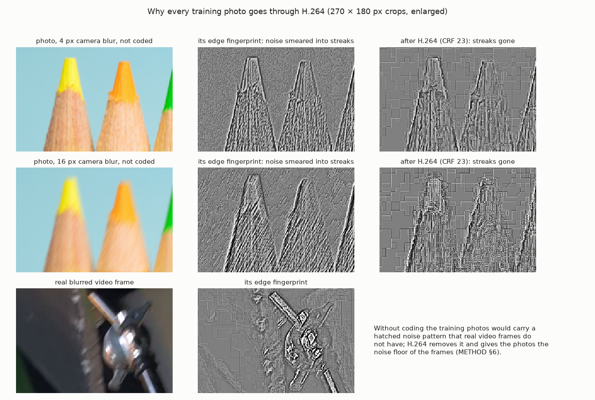

*The figure's "streaks gone" and noise-floor labels describe these examples; the qualified measurement claim is below.*

*Top two rows: a demo photo (UHD-IQA, CC0) with 4 px and 16 px of simulated camera blur. Without coding, the camera
noise of the photo is smeared by the blur into fine parallel streaks along the motion, a hatched pattern that is
conspicuous in the edge fingerprint even at 4 px and a potential shortcut for the model. After one H.264 frame
(CRF 23) the streaks are strongly suppressed in this example. In the exploratory comparison of METHOD §6, CRF 23
ranked closest under a heuristic combining flat-region residual, near-zero, block and horizontal-correlation statistics;
it was not closest on flat-region amplitude alone. These residual measures are proxies, not isolated sensor-noise
measurements or a guarantee for all codecs (bottom row: a blurred raw camera frame of Tears of Steel, (CC) Blender Foundation | mango.blender.org,
CC BY 3.0, prepared as described in test_images/README.md). The fingerprint is shown around mid-grey: darker = negative,
lighter = positive. Every photo of the training set goes through this chain: blur in linear light, then H.264, then
decoding (METHOD §6).*

## Results (validation, 100 epochs)

Validation uses **videos never seen in training**, balanced per video (3,301 sharp and 3,301 blurred frames from 11
video groups). The frame labels come from the teacher, so these figures measure **agreement with the teacher**, not
correctness (METHOD §9). The *confident* subset contains only frames whose teacher label agrees with the
measurement (533 sharp, 1,788 blurred).

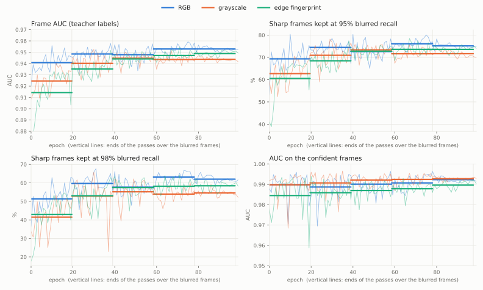

*Thin lines: single epochs. Thick lines: mean per pass over the blurred training frames (one pass ≈ 19.5 epochs). The
curves oscillate with the data cycles, so runs are compared by pass means, not by single epochs.*

Mean per pass over the blurred frames: frame AUC / sharp kept at 95% / sharp kept at 98% blurred recall / AUC on the
confident frames.

| pass | RGB | grayscale | edge fingerprint |
|---|---|---|---|
| 1 | 0.941 / 69.3% / 51.4% / 0.990 | 0.925 / 62.7% / 41.5% / 0.990 | 0.914 / 60.5% / 43.0% / 0.985 |
| 2 | 0.948 / 74.5% / 59.7% / 0.989 | 0.940 / 70.9% / 52.9% / 0.991 | 0.935 / 68.4% / 53.1% / 0.986 |
| 3 | 0.948 / 72.6% / 57.7% / 0.990 | 0.945 / 73.4% / 55.2% / 0.992 | 0.944 / 72.8% / 57.5% / 0.987 |
| 4 | 0.953 / 76.1% / 63.2% / 0.991 | 0.944 / 71.6% / 54.0% / 0.992 | 0.947 / 73.6% / 58.2% / 0.988 |
| 5 | 0.953 / 75.1% / 62.0% / 0.992 | 0.944 / 71.6% / 54.6% / 0.993 | 0.949 / 73.6% / 58.4% / 0.990 |

Last epoch (epoch 99):

| input | frame AUC | sharp kept at 90% / 95% / 98% recall | confident AUC |
|---|---|---|---|
| RGB | 0.952 | 84.8% / 74.9% / 61.7% | 0.992 |
| grayscale | 0.942 | 83.1% / 70.0% / 52.1% | 0.993 |
| edge fingerprint | 0.949 | 83.1% / 73.9% / 58.2% | 0.990 |

On the held-out photos (exact injected blur length, 2,000 sharp and 2,000 blurred) every run reaches an AUC of at least 0.999 at every
epoch: separation of the two chosen synthetic extremes is nearly perfect on these photos; the native-frame task is
harder on the evaluated material.

**Reading.**
- All three inputs converge to a similar level by the third pass over the blurred frames. RGB learns faster and ends a few
  points ahead at the strict operating points (about 2 points at 95%, 4–5 points at 98% in the last two passes).
- On the confident frames, where the teacher label agrees with the measurement, the order changes: grayscale is
  highest from the second pass on, and in the last pass all three lie within 0.004 of each other. Part of RGB's lead at 98% may therefore
  be agreement with the teacher, which also sees the RGB image.
- On this material, the signed residual alone supports blur discrimination at a level close to the RGB and grayscale
  runs. For the ideal, unnormalised and unmasked exact-arithmetic operator `d = Y − K * Y` with replicated borders, luminance is recoverable in
  principle up to a constant, though the inversion is ill-conditioned. This statement does not establish exact
  invertibility of the published bfloat16-rounded implementation. Per-image normalisation reduces dependence on
  residual scale (with a floor), and colour is lost (METHOD §7). These results do not identify which cues each model
  uses or show that the models use the same ones; the cross-test measures sensitivity to representation changes.

### Training frames against unseen videos

Every run was also evaluated after every epoch on a fixed subset of its own training data, with the threshold taken from
the validation frames (METHOD §9).

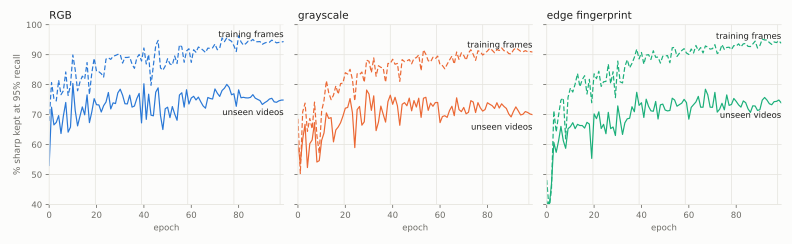

On the training frames every input keeps improving to the end (frame AUC 0.993–0.997, 91–94% kept at 95%), while on
unseen videos the curves flatten after the third pass; the gap grows to 19–20 points. None of the models reaches 100% on
its own training frames.

## Evaluation on material outside the training data

Every model is evaluated at its own operating points: the thresholds that catch 90, 95 or 98% of the blurred frames of
its validation split. The epoch-99 comparisons below use the fixed final epoch and validation-derived thresholds,
without fitting either to these external evaluation sets. The alternative checkpoints in "Weights" were selected
using the same external sets, so those sets also serve as selection data and are not untouched final tests for those
checkpoints.

| external evaluation set | what it is | reference |
|---|---|---|
| demo photos | 1,000 photos of the [UHD-IQA Benchmark Database](https://database.mmsp-kn.de/uhd-iqa-benchmark-database.html) (CC0), each with simulated camera blur of L = 0, 0.5 … 6 and 16 px through the coding chain of METHOD §6 | exact injected blur length: 0–3 px sharp, 16 px blurred (4–6 px not counted) |
| demo frames | 1,000 raw camera frames of *Tears of Steel* ((CC) Blender Foundation, mango.blender.org, CC BY 3.0), 1080p, one H.264 frame | the teacher's code: `sss` sharp, `bbb` / `bsb` blurred, other codes left out. A reference, not ground truth |
| GoPro pairs | 1,029 sharp / blurred pairs of the GoPro deblurring dataset (Nah et al., CVPR 2017), native and through one H.264 frame (CRF 23) | the pair; the blur is synthetic (see below) |

**How the GoPro blur was made, and why it is new to the detectors.** According to the original paper (Nah, Kim and Lee,
CVPR 2017), the GoPro images were recorded at 240 frames per second; a blurred image is the average of 7 to 13
consecutive frames after linearising the gamma, and its sharp counterpart is the middle frame among those averaged. Such a blur is a sum of
discrete copies: on one pair (a car's tail light) we counted 7 edge copies about 6.3 px apart. The detectors never saw
blur made this way: the synthetic blur of their training photos is a continuous motion of 0–3 or 16–30 px (METHOD §6),
and the blur of their training frames is native. The GoPro pairs therefore test blur produced in a way that is absent from the training data, a sampled
approximation of the exposure integral, rather than a new physical kind of blur. The copy used here has 1,029 pairs
(the original paper lists 1,111 test pairs); it was obtained from a public mirror, and which subset it is was not
established.

**How to read the three-set diagrams.** Each panel shows the images of one reference class at one operating point. The
three circles hold the images that the RGB, grayscale and edge-fingerprint model (epoch 99) call *blurred*; the numbers
are image counts per region, and the number outside the circles counts the images all three call *sharp*. In the
upper row (reference sharp) everything inside the circles is a false alarm; in the lower row (reference blurred)
everything inside is caught and the number outside is missed by all three models. The diagrams show not only how many
errors a model makes, but whether the models make the same ones.

The percentages under the diagrams ("caught", "false alarm") count images called blurred by **at least one** of the
three models.

**Per model** (epoch 99, operating point 95%; sharp kept / blurred caught):

| material | RGB | grayscale | edge fingerprint |
|---|---|---|---|
| validation frames (teacher labels) | 74.9% / 95% | 70.0% / 95% | 73.9% / 95% |
| demo photos, 0–3 px vs 16 px | 89.9% / 99.9% | 89.1% / 100% | 95.2% / 100% |
| demo frames (teacher reference) | 86.1% / 62.7% | 86.3% / 51.6% | 99.1% / 39.3% |
| GoPro, native | 64.2% / 96.7% | 66.8% / 98.0% | 97.3% / 73.3% |
| GoPro, H.264 | 99.7% / 79.9% | 99.0% / 63.9% | 99.8% / 59.3% |

The 95% operating point is a calibration target on the validation frames, not a recall guarantee on other material:
on the external sets the thresholds shift the balance between kept and caught images, in different directions for the
three inputs. The demo-frame row measures agreement with the teacher.

**Limits of these results.** One training run per input (one seed); the differences of a few points between the inputs
are not yet backed by confidence intervals (video-level bootstrap is planned). The held-out test split of the labelled
videos (7 video groups) has not been evaluated yet; it will be, once for the chosen checkpoints. Checkpoints chosen on
the external sets above turn them into selection data, so final claims about such a checkpoint need material that was
not used to choose it.

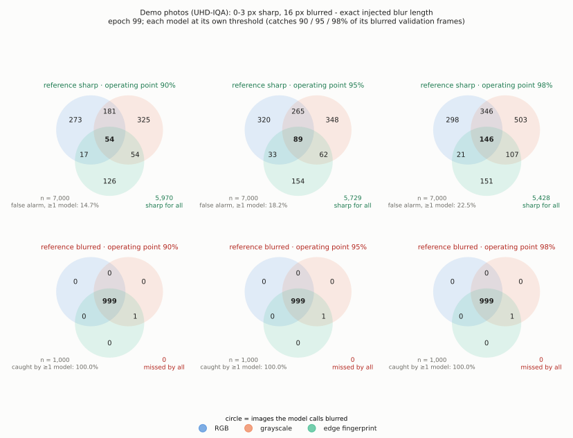

*Demo photos (exact injected blur length). At every operating point 999 of the 1,000 photos with 16 px blur are caught
by all three models and the remaining one by the grayscale and fingerprint models. On the sharp side (7,000 images, 0–3 px) the false alarms are mostly different for each model; only a small
part is common to all three.*

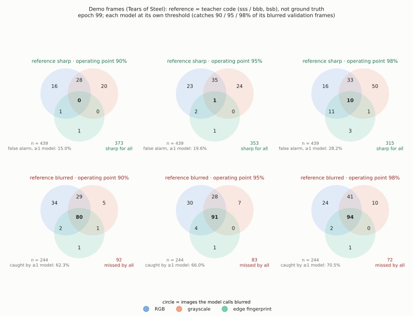

*Demo frames, measured against the teacher's code (agreement, not accuracy). A large common core of caught frames, and a
group of frames the teacher calls blurred that all three models call sharp; the decisions of the edge-fingerprint model
are almost entirely contained in those of the other two.*

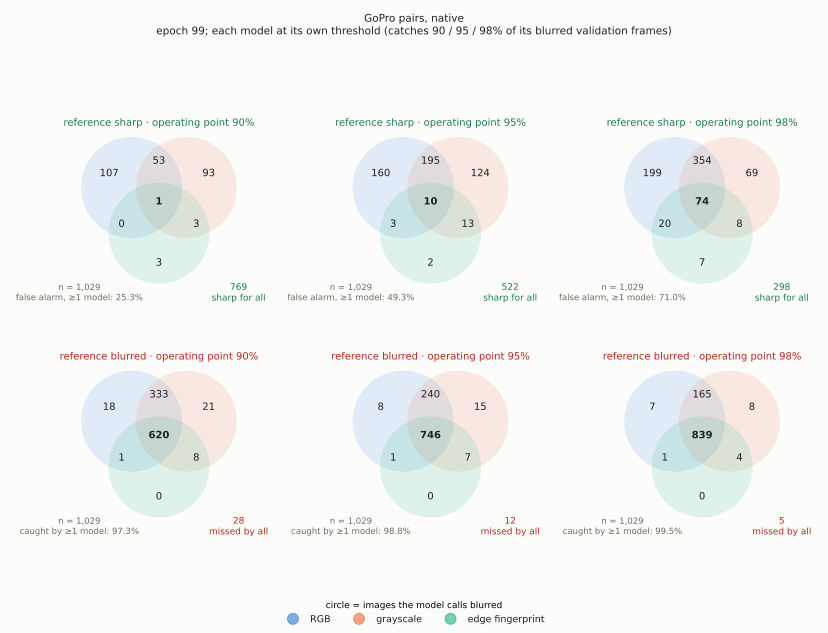

*GoPro pairs, native.*

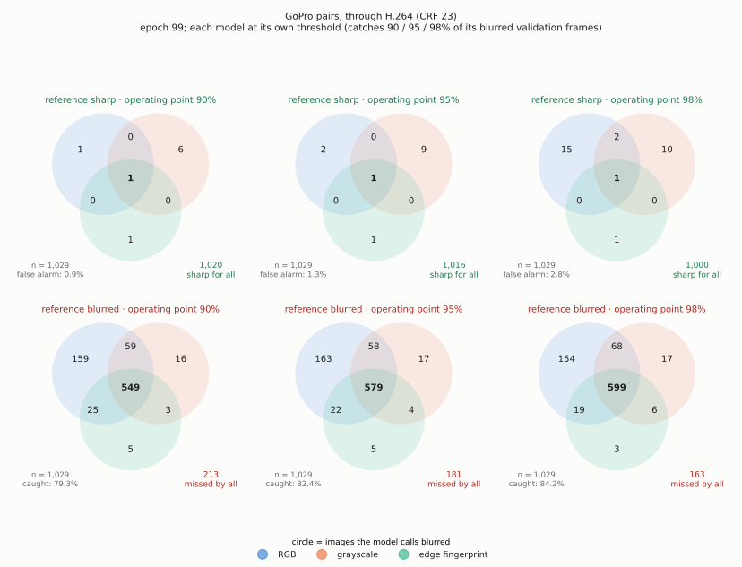

*GoPro pairs through H.264. After coding, weak blur is missed more often (by all three models); the RGB model catches the
largest number of blurred images that the other two miss.*

The same diagrams for the first epochs (0–5), when the models are still close to their pretrained weights, are in
[figures/venn](figures/venn).

### Cross-test: every model on the other models' input

Each model is given the finished input of the other models, its own input processing bypassed and nothing converted
(channels are only copied or selected to fit the first layer; the edge-fingerprint model, whose first layer takes one
image channel, gets the grayscale input as is and the RGB input one colour channel at a time). Same external evaluation material,
same operating points. Epoch 99, operating point 95%:

| model ← input | demo photos AUC | sharp photos kept | 16 px caught | demo frames AUC (vs teacher) | GoPro AUC native / H.264 |
|---|---|---|---|---|---|
| RGB ← own | 0.999 | 89.9% | 99.9% | 0.810 | 0.968 / 0.945 |
| RGB ← grayscale | 1.000 | 69.4% | 100% | 0.899 | 0.980 / 0.976 |
| RGB ← fingerprint | 0.741 | 97.4% | 8.0% | 0.575 | 0.534 / 0.840 |
| grayscale ← own | 1.000 | 89.1% | 100% | 0.718 | 0.978 / 0.929 |
| grayscale ← RGB | 1.000 | 90.7% | 100% | 0.692 | 0.977 / 0.922 |
| grayscale ← fingerprint | 0.732 | 48.3% | 81.3% | 0.798 | 0.555 / 0.845 |
| fingerprint ← own | 0.999 | 95.2% | 100% | 0.675 | 0.931 / 0.912 |
| fingerprint ← grayscale | 0.699 | 0.9% | 99.9% | 0.576 | 0.763 / 0.767 |
| fingerprint ← R / G / B channel | 0.65–0.72 | 0.5–1.4% | 99.8–100% | 0.46–0.71 | 0.74–0.75 |

Observations:
- **RGB and grayscale transfer well, but are not calibration-equivalent.** The grayscale model performs similarly on
  the RGB input; the RGB model also separates blur well on grayscale. However, at its unchanged threshold the RGB model
  keeps 69.4% of the sharp demo photos on grayscale versus 89.9% on its own input. Colour is not necessary to reach a
  similar performance level on this material; this does not establish that the two models use the same features.
- **Little transfer between the fingerprint and the image.** The RGB model calls the fingerprint almost always sharp,
  the fingerprint model calls the full image almost always blurred; the grayscale model transfers partly (on the
  fingerprint it still catches 81% of the 16 px blur and agrees with the teacher on the demo frames better than on its
  own input, but keeps only 48% of the sharp photos). The models are adapted to their training representation: a direct
  swap changes both the ranking and the calibration. This does not show that the information a model uses is missing
  from the other representation (the residual is a deterministic function of the image); the cause cannot be separated
  in this test.
- **Early epochs differ.** After the first epoch the fingerprint model still decides well on the grayscale image (demo
  photos AUC 0.931, GoPro native 0.940), while its first layer and trunk are still close to the ImageNet weights; by
  epoch 5 this transfer has declined. This is consistent with early adaptation to the residual representation.
- **The GoPro operating-point trade-off differs by input.** On native and H.264 GoPro images the fingerprint model keeps
  97% and 99.8% of the sharp ones, whereas the RGB model keeps 64.2% of the native sharp images after epoch 99
  (98.7% after epoch 0). At epoch 99 the fingerprint model catches 73% of the native GoPro blur, the RGB model 97%.
  These decisions do not isolate dependence on image content or prove that discrete edge copies cause the difference.

In the three-set diagrams below all three models are given the same input; the circles are the models.

<details><summary>Given the RGB image (fingerprint model: green channel): three-set diagrams (epoch 99)</summary>

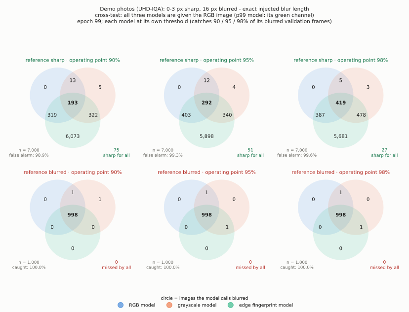

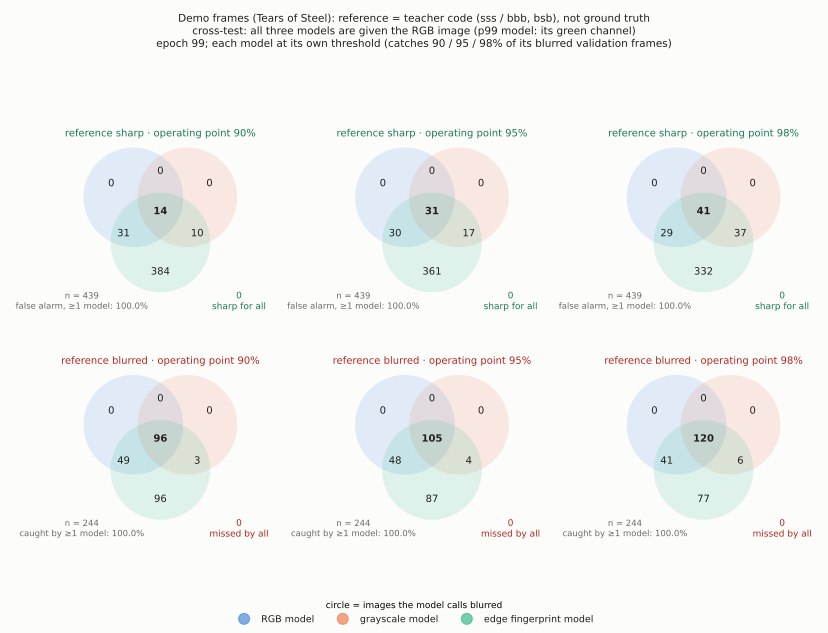

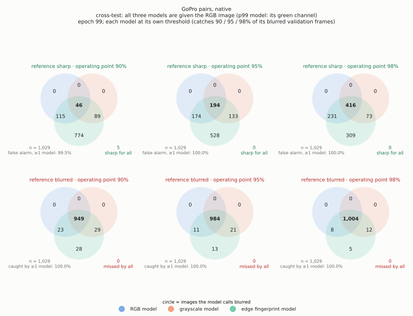

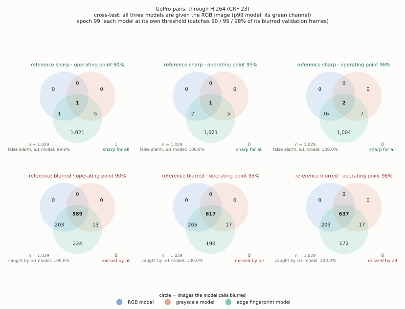

</details>

<details><summary>Given the grayscale image: three-set diagrams (epoch 99)</summary>

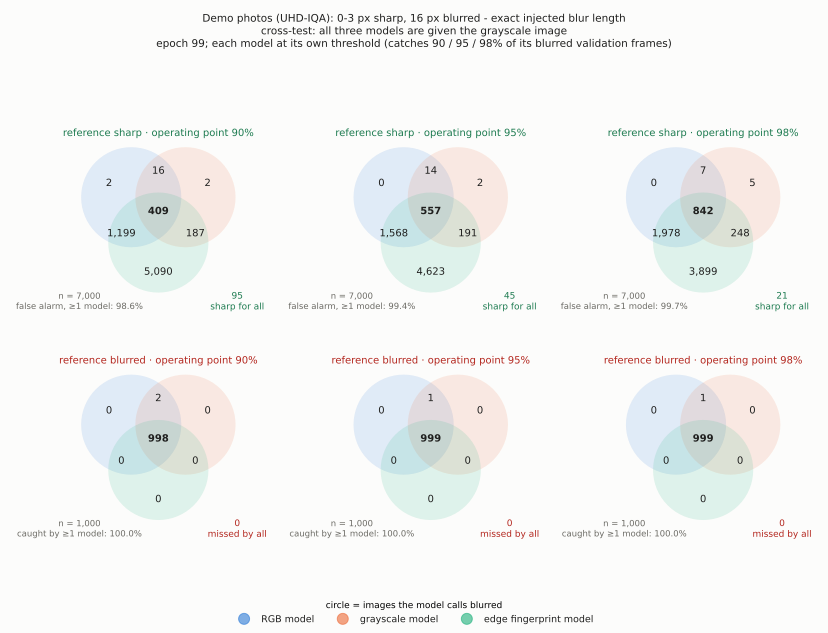

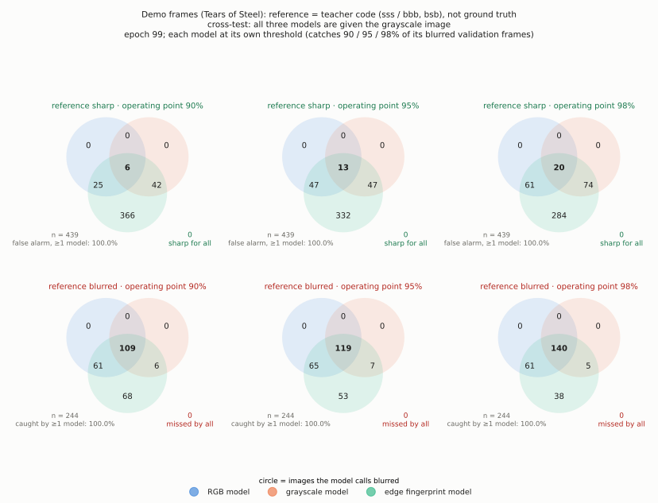

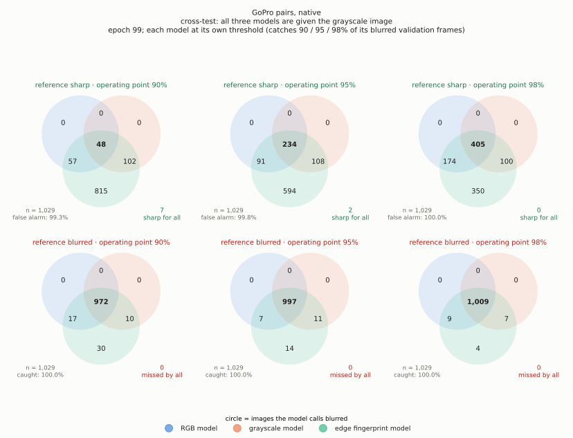

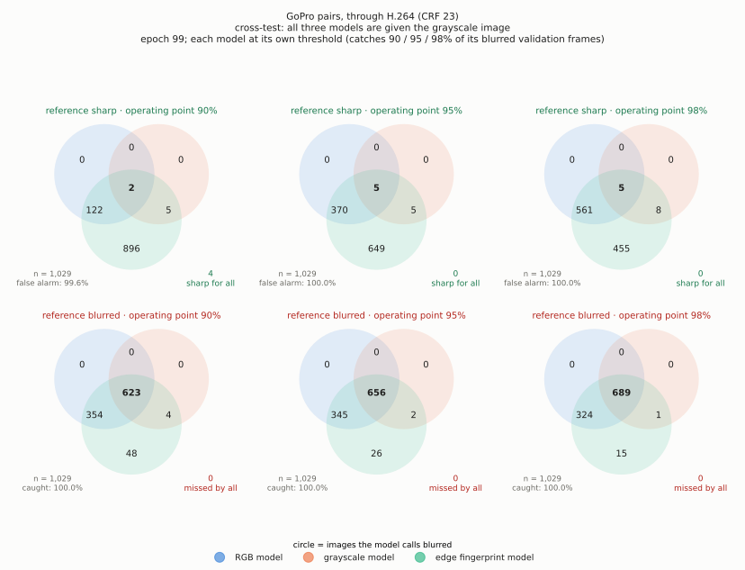

</details>

<details><summary>Given the edge fingerprint: three-set diagrams (epoch 99)</summary>

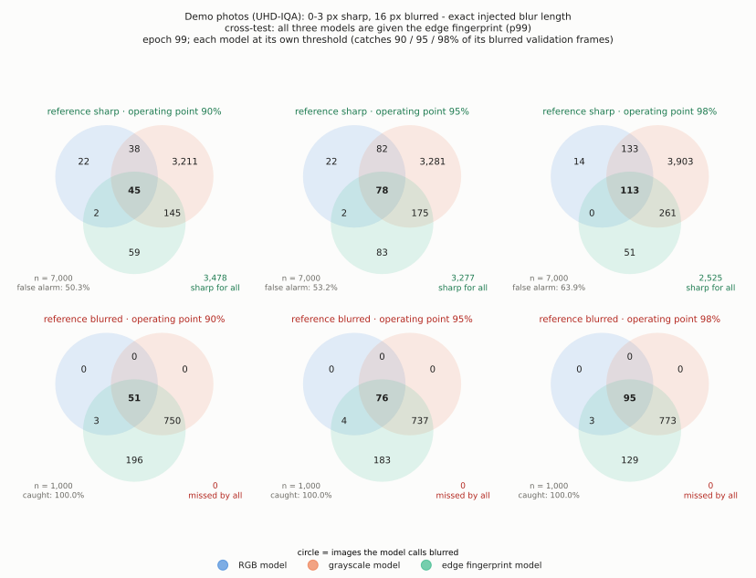

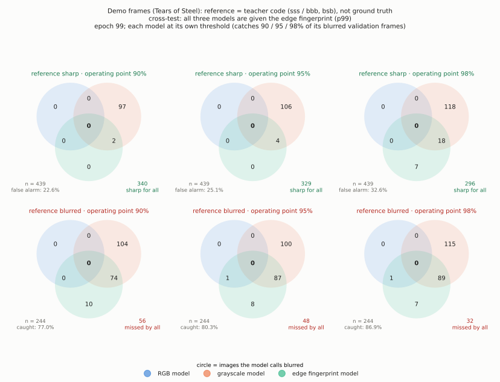

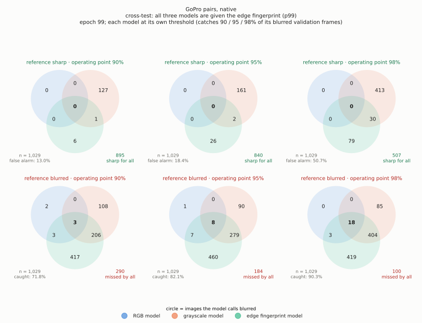

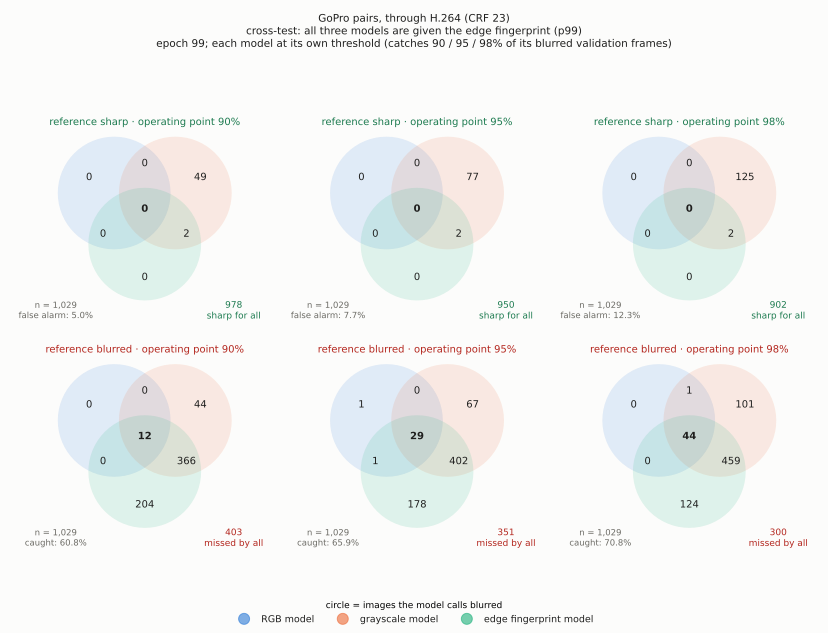

</details>

The diagrams of the first epochs (0–5) are in [figures/venn_crosstest](figures/venn_crosstest).

## Demo: sort images into sharp / blur

```
pip install -r requirements.txt
python classify.py --weights weights/p99_ep099.pt --input test_images/typical --output sorted
```

Every image of `--input` is scored and copied to `sorted/sharp` or `sorted/blur`; `sorted/results.csv` lists the blur
score and the decision (the sigmoid output of the model; a score, not a calibrated probability). `--recall 90 | 95 | 98` selects the decision threshold stored with the weights (the one
that catches that share of the blurred validation frames; higher = stricter), `--move` moves instead of copying. A GPU is
used when available; on the CPU the network runs in float32. Scores can differ with device, precision and batching;
differences of about 0.01–0.04 were observed in some CPU/GPU comparisons, not established as a general error bound.
The fingerprint's bfloat16 rounding is reproduced on both devices (METHOD §7). The models were trained for 1080p
video frames decoded from H.264 and stored as lossless PNG.
In use, *blur* stands for "not usable" (METHOD §1). `test_images/typical` shows the normal behaviour,
`test_images/hard_cases` a deliberate stress test; their scores at all three operating points are listed in
`test_images/README.md`.

## Weights

| file | input | epoch | thresholds r90 / r95 / r98 | validation frame AUC |
|---|---|---|---|---|
| `weights/rgb_ep099.pt` | RGB image | 99 (last) | 0.885 / 0.0200 / 0.0041 | 0.952 |
| `weights/gray_ep099.pt` | grayscale image | 99 (last) | 0.281 / 0.0135 / 0.0028 | 0.942 |
| `weights/p99_ep099.pt` | edge fingerprint | 99 (last) | 0.889 / 0.0323 / 0.0053 | 0.949 |
| `weights/rgb_ep073.pt` | RGB image | 73 | 0.965 / 0.1078 / 0.0149 | 0.954 |
| `weights/gray_ep058.pt` | grayscale image | 58 | 0.112 / 0.0321 / 0.0064 | 0.947 |
| `weights/p99_ep053.pt` | edge fingerprint | 53 | 0.570 / 0.1320 / 0.0491 | 0.951 |

ConvNeXt-Small (ImageNet-pretrained) to stride 16, about 34 M parameters; each file holds the state dict and its metadata
(input type, epoch, thresholds). The last epoch is the main result. The three further checkpoints (RGB epoch 73, grayscale epoch 58,
fingerprint epoch 53) were chosen on the external evaluation sets as the stricter alternatives: on the GoPro pairs and the
demo frames they catch more blur than epoch 99, at the cost of keeping fewer sharp photos. Because they were chosen on
these sets, the sets are selection data for them; the held-out test split has not yet been evaluated and will be
reported separately after a one-time evaluation of the chosen checkpoints. The files are stored with Git LFS
(`git lfs install` before cloning). The weights were trained on
non-public material (METHOD §12).

## Data availability

The training data is **not published**: it was built from copyrighted videos and photographs. No images, frames, crops or
derived images from that dataset are published. Published are the method, selection and labelling rules, reported
metrics, inference code and trained weights. The training, labelling, selection and evaluation code, configurations
and recorded run-provenance manifests are not yet included in the public repository, limiting independent
reproduction (METHOD §12). The repository's demonstration images use separately credited openly licensed sources.

## Related work

Earlier work provides precedents for blur detection, normalised residual inputs and VLM-based quality supervision.
The references below position the components of this study; their tasks, datasets and evaluation protocols differ.

- **Shi, Xu and Jia, [Discriminative Blur Detection Features](https://www.cv-foundation.org/openaccess/content_cvpr_2014/papers/Shi_Discriminative_Blur_Detection_2014_CVPR_paper.pdf)
  (CVPR, 2014).** Gradient, Fourier and learned local-filter features for blur detection, with the pixel-labelled CUHK
  benchmark. An early precedent for learning from local high-frequency evidence; the method uses feature-based blur
  maps rather than the normalised signed residual and ConvNeXt used here.
- **Bayar and Stamm, [A Deep Learning Approach To Universal Image Manipulation Detection Using A New Convolutional Layer](https://doi.org/10.1145/2909827.2930786)
  (ACM IH&MMSec, 2016).** A constrained convolution produces a signed prediction-error residual to suppress image
  content and expose processing traces; Gaussian-blur detection is among the experiments. This is a residual-domain
  CNN precedent, with manipulation detection as its task and learned filters rather than the fixed mesh kernel.
- **Yu et al., [A shallow convolutional neural network for blind image sharpness assessment](https://journals.plos.org/plosone/article?id=10.1371/journal.pone.0176632)
  (PLOS ONE, 2017).** A CNN predicts sharpness from grayscale patches after local mean subtraction and contrast
  normalisation, and RGB and grayscale inputs are compared. A close precedent for normalised residual-based sharpness
  learning; its target is a continuous quality score on Gaussian-blur data, with local rather than per-image p99
  normalisation.
- **Kim et al., [Defocus and Motion Blur Detection with Deep Contextual Features](https://doi.org/10.1111/cgf.13567)
  (Computer Graphics Forum, 2018).** Real and synthetic blur images train an RGB encoder-decoder to distinguish sharp,
  motion-blurred and defocused pixels. Related to combining real and synthetic supervision and to the planned blur-type
  stage; it uses pixel-level labels and contextual features rather than VLM-derived frame labels.
- **Alvarez-Gila et al., [Self-supervised Blur Detection from Synthetically Blurred Scenes](https://doi.org/10.1016/j.imavis.2019.08.008)
  (Image and Vision Computing, 2019; [open manuscript](https://arxiv.org/abs/1908.10638)).** Synthetic defocus and motion
  blur provide masks for a DeepLab detector; real and synthetic data are also combined. Random JPEG compression during
  preprocessing discourages dataset-specific low-level cues, a conceptual precedent for the coding-chain treatment
  here. Its synthetic region masks and JPEG augmentation serve a different role from native video labels and H.264
  exploratory residual-statistics alignment.
- **Li et al., [Decoupling Perception and Calibration: Label-Efficient Image Quality Assessment Framework (LEAF)](https://arxiv.org/abs/2601.20689)
  (arXiv preprint, January 2026).** A frozen InternVL teacher supplies quality judgments and confidence-weighted pairwise
  preferences to an ImageNet-pretrained ConvNeXt student, with optional calibration using limited human quality scores.
  A close precedent for VLM-to-CNN quality supervision; the task is general image-quality regression, whereas this study
  uses filtered blur-specific video labels and synthetic blur anchors.
- **Samarth et al., [Subtle Motion Blur Detection and Segmentation from Static Image Artworks](https://arxiv.org/abs/2602.18720)
  (WACV workshop, 2026).** Local camera- and object-motion synthesis and an ImageNet-pretrained U-Net detector target
  subtle blur in artwork and video-frame selection, including small foreground regions such as faces and hands.
  Closely related in application and local-blur emphasis; training uses synthetic region masks, with segmentation and
  blur-intensity outputs.
- **Duy Tran Thanh, [Edges Before Embeddings: A Confidence-Aware Blur Gate for Vision-Language Pipelines](https://arxiv.org/abs/2606.25838)
  (arXiv preprint, June 2026).** A GoPro-trained MobileNet blur gate adds a per-image-standardised Laplacian-magnitude
  channel to RGB and permits an uncertain decision. A close edge-input classification precedent; its edge magnitude is
  an auxiliary RGB channel, while the fingerprint run here uses the signed residual as its image input. VLMs are
  downstream consumers in that pipeline.

The contribution evaluated here is the combination of filtered VLM supervision on native video frames,
measurement-based selection of sharp frames, synthetic blur anchors passed through H.264, and a comparison of RGB,
grayscale and signed residual inputs. The specific empirical finding is that the fixed, signed mesh residual in its
published bfloat16-rounded implementation, used as the sole image channel, reaches a validation discrimination level
close to the full-image runs on this material. An exact float32 residual was not tested in these runs.
The ideal residual is algebraically a fixed weighted discrete Laplacian (METHOD §7). Residual-domain learning,
blur detection and VLM supervision each have precedents; these results establish neither
priority for the combination nor universal blur detection or statistical equivalence of the three inputs.

## Related work by the author

- [RGB Mesh Resampling](https://github.com/mschauta/rgb-mesh-resampling): the continuous RGB-mesh reconstruction from
  which the edge fingerprint is derived.

## License

[MIT](LICENSE) © Dr. Schauta Marcell
